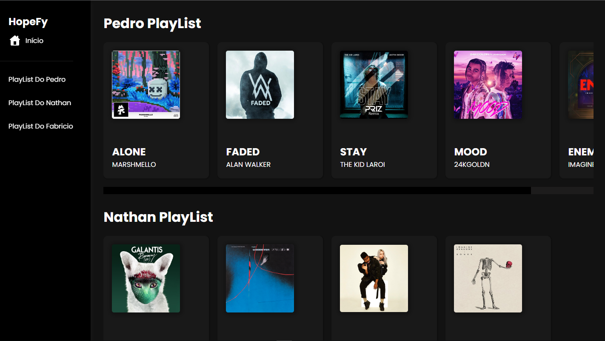

# Smify

Nesse projeto eu usei todas a minhas habilidades em implementação de JSON, Todos os dados foram colocados em um JSON.

Meu desafio era fazer com que eles aparecerem na tela.
Realizarem todas as suas funcionalidades que são : PLAY, STOP e FILTROS para cada PlayList.

 

<h1>Welcome! The challenge 👋</h1>

Link para testar o projeto : <a href="https://smify-portifolio.netlify.app/">Smify</a> - RESPONSIVO ✔️

<ul>

Nesse Projeto Usei as seguintes tecnologias :

<li>HTML
<li>CSS
<li>SASS
<li>JavaScript
<li>JSON
<li>Git
<li>Github
<li>Node.js
</ul>
